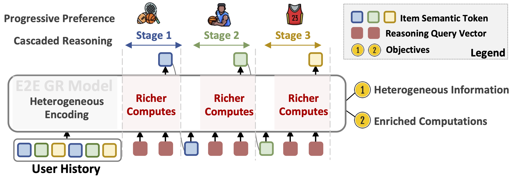

# CARE

This is the PyTorch implementation of the paper:

> **Bringing Reasoning to Generative Recommendation Through the Lens of Cascaded Ranking**  
> Xinyu Lin, Pengyuan Liu, Wenjie Wang, Yicheng Hu, Chen Xu, Fuli Feng, Qifan Wang, Tat-Seng Chua  
> [arXiv:2602.03692](https://arxiv.org/abs/2602.03692)

---

## Method Overview



**CARE** addresses these with two mechanisms:

- **Progressive History Encoding** — as generation proceeds from coarse to fine identifier tokens, each step gradually attends to finer-grained historical signals via a progressive attention mask. This breaks the homogeneous reliance on a single history summary.

- **Query-Anchored Reasoning** — at each generation step, multiple learnable query tokens perform parallel reasoning over the interaction history, enriching the computational budget available for preference understanding before each identifier token is generated.


---

## Requirements

- Python 3.10
- PyTorch 2.6.0
- Transformers 4.49.0

---

## Repository Structure

```
CARE/
├── code/                        # Model and training code
│   ├── models.py                # CARE model (Qwen2-based with progressive attention)
│   ├── train.py                 # Training entry point
│   ├── inference.py             # Inference entry point
│   ├── data.py                  # Dataset loading
│   ├── collator.py              # Data collation for training and inference
│   ├── utils.py                 # Utility functions
│   ├── generation_trie.py       # Trie-constrained beam search decoding
│   ├── scripts/
│   │   └── run_video_games.sh   # Example training + inference script
│   └── zero2.yaml               # DeepSpeed ZeRO-2 config (default)
└── data/                        # Datasets
    ├── train/                   # Training splits
    ├── valid/                   # Validation splits
    ├── test/                    # Test splits
    └── info/                    # Item metadata, embeddings, TIGER/LETTER indices
```

---

## Dataset

All datasets are stored under `data/`. We experiment on three Amazon datasets and the MicroLens dataset:

| Dataset | Domain | Location |
|---|---|---|
| Video Games | Game products | `data/{train,valid,test}/Video_Games_5_2012-10-2018-11.csv` |
| Sports and Outdoors | Sports products | `data/{train,valid,test}/Sports_and_Outdoors_5_2016-10-2018-11.csv` |
| Toys and Games | Toy products | `data/{train,valid,test}/Toys_and_Games_5_2016-10-2018-11.csv` |
| MicroLens | Short videos | `data/{train,valid,test}/MicroLens.csv` |

Each dataset's `data/info/` folder contains:
- `<dataset>.TIGER-index.json` — TIGER item identifier index
- `<dataset>.emb-Qwen-comb.npy` — Qwen item semantic embeddings
- `<dataset>_*_map.npy` — item/user/title/brand/category/description ID maps

---

## Training

**Step 1.** Set the path to your pretrained LLM (Qwen2.5-0.5B) in the script:

```bash
# In code/scripts/run_video_games.sh
base_model=/your/path/to/pretrained_models/Qwen2.5-0.5B
```

**Step 2.** Run training with the provided script:

```bash
cd code
bash scripts/run_video_games.sh
```

Or launch manually:

```bash
cd code
accelerate launch --config_file zero2.yaml \
  --main_process_port 25000 train.py \
  --base_model /path/to/Qwen2.5-0.5B \
  --output_dir ./ckpt/Video_Games \
  --dataset Video_Games \
  --query_div_scale 0.3 \
  --progressive_attn \
  --query_list 1 1 1 1 \
  --progressive_list 1 1 1 1 \
  --per_device_batch_size 128 \
  --learning_rate 5e-5 \
  --epochs 15 \
  --weight_decay 0.01 \
  --save_and_eval_strategy steps \
  --save_and_eval_steps 200 \
  --valid_sample -1 \
  --warmup_steps 100 \
  --test_batch_size 32 \
  --num_beams 20 \
  --special_token_for_answer "|start_of_answer|" \
  --only_train_response \
  --index_file .TIGER-index.json
```

**Key training arguments:**

| Argument | Description |
|---|---|
| `--dataset` | Dataset name (e.g., `Video_Games`) |
| `--base_model` | Path to pretrained Qwen2.5 model |
| `--query_list` | Number of query tokens per reasoning stage (e.g., `1 1 1 1` for 4-token identifiers) |
| `--progressive_list` | Whether to use progressive attention per stage (`1`) or standard causal attention (`0`) |
| `--progressive_attn` | Enable progressive history encoding |
| `--query_div_scale` | Diversity regularization weight for query-anchored reasoning |
| `--index_file` | Item identifier index file suffix (`.TIGER-index.json`) |

---

## Inference

After training, run inference on the test set:

```bash
cd code
torchrun --nproc_per_node=1 --master_port=19324 inference.py \
  --dataset Video_Games \
  --base_model /path/to/Qwen2.5-0.5B \
  --ckpt_path ./ckpt/Video_Games_experiment \
  --query_list 1 1 1 1 \
  --progressive_list 1 1 1 1 \
  --progressive_attn \
  --test_batch_size 50 \
  --num_beams 20 \
  --index_file .TIGER-index.json \
  --filter_items
```

**Key inference arguments:**

| Argument | Description |
|---|---|
| `--ckpt_path` | Path to saved model checkpoint |
| `--num_beams` | Beam size for constrained beam search |
---

## Citation

If you find this work helpful, please cite:

```bibtex
@inproceedings{lin2026care,
  title={Bringing Reasoning to Generative Recommendation Through the Lens of Cascaded Ranking},
  author={Lin, Xinyu and Liu, Pengyuan and Wang, Wenjie and Hu, Yicheng and Xu, Chen and Feng, Fuli and Wang, Qifan and Chua, Tat-Seng},
  booktitle={WWW},
  year={2026}
}
```
